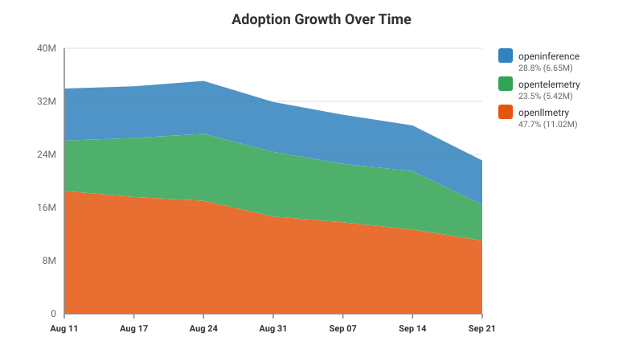
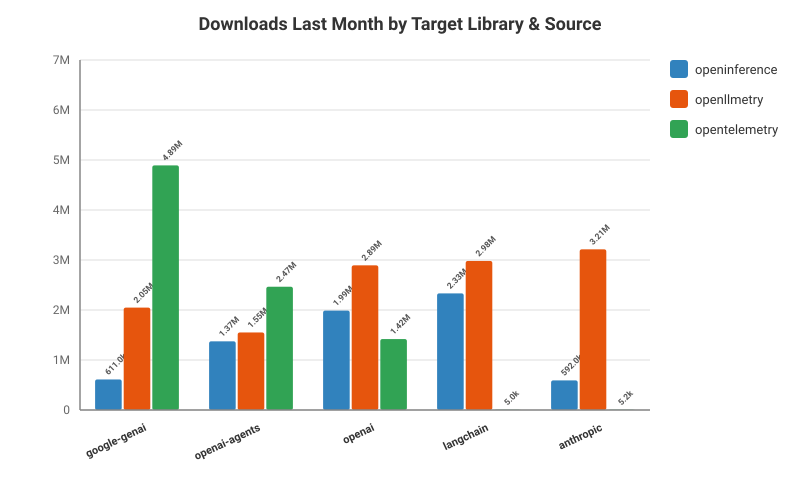
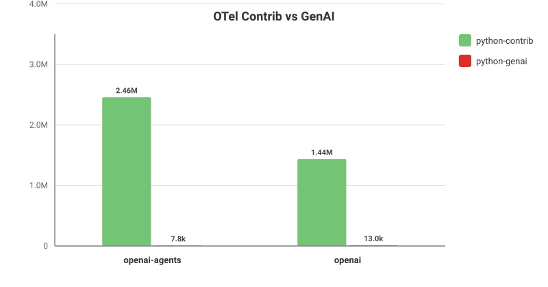

# OpenTelemetry GenAI Instrumentation Adoption Dashboard

This dashboard visualizes the PyPI download statistics for the Generative AI instrumentation packages across different repository sources:
- `opentelemetry` (Official CNCF packages, combining `python-genai` and `python-contrib`)
- `openinference` (OpenInference packages)
- `openllmetry` (Traceloop / OpenLLMetry packages)

---

## 1. Adoption Growth Over Time

This chart shows the total aggregate monthly downloads for each package source.
> [!NOTE]
> Currently displays a single vertical stacked line representing the actual compiled data point for August 2026.

---

## 2. Compare Adoption Across Sources

This chart compares the downloads last month for each target library across all available instrumentation package sources.

---

## 3. OTel Contrib vs GenAI

This chart compares the downloads last month for the legacy `python-contrib` packages against the new `python-genai` packages.
> [!NOTE]
> This highlights the shift in adoption from legacy packages (e.g., in `python-contrib`) to the new, GenAI-specific packages in this repository (`python-genai`).

---

*Charts generated on: 2026-08-17*
